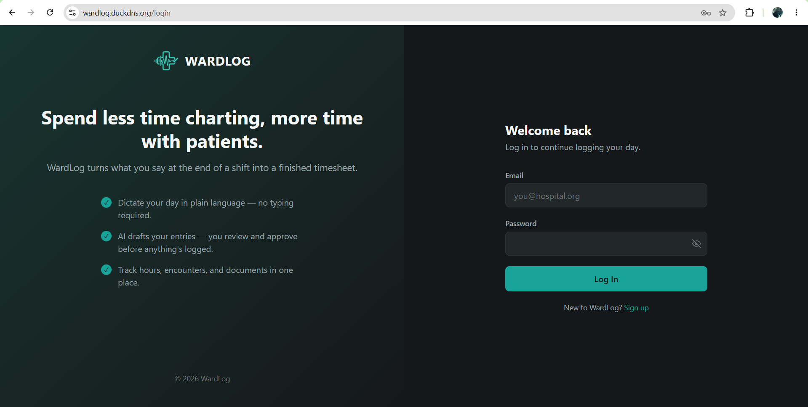
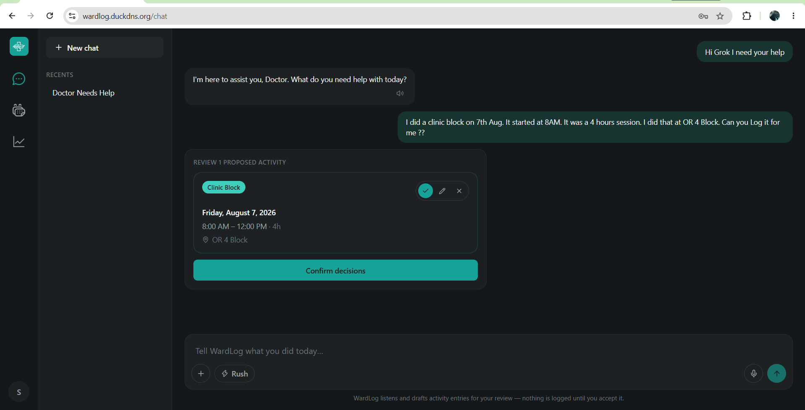
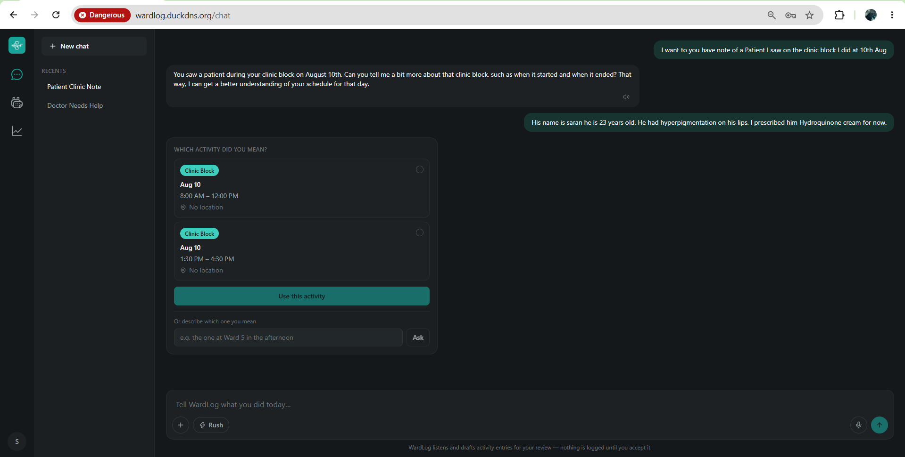
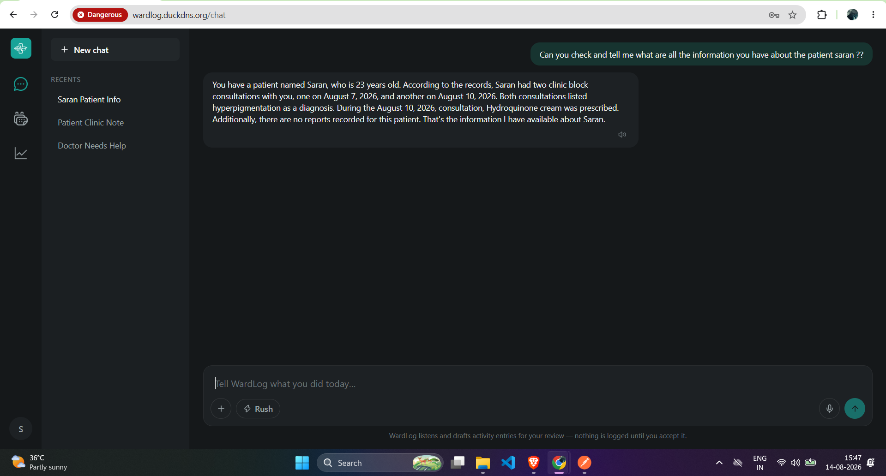
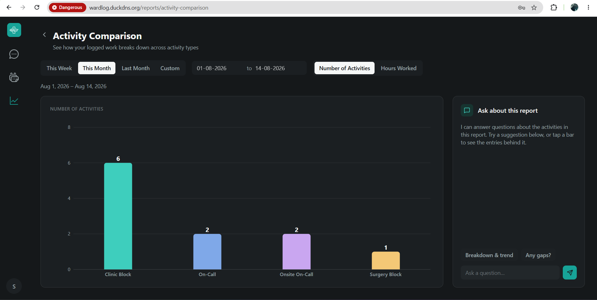
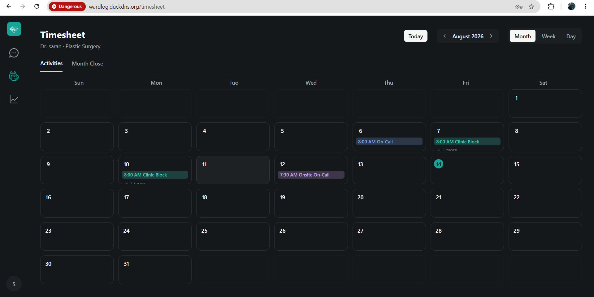
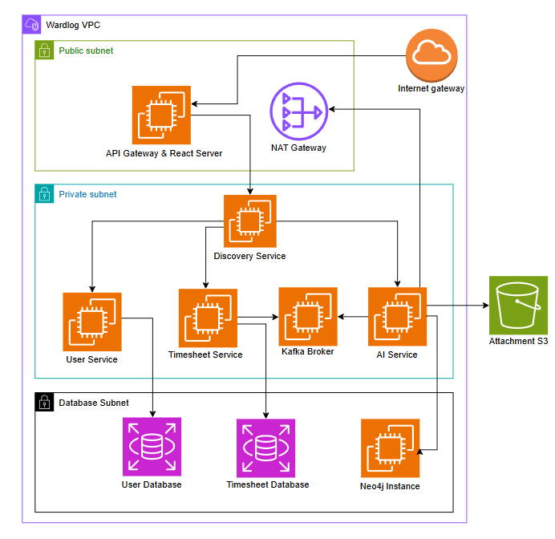
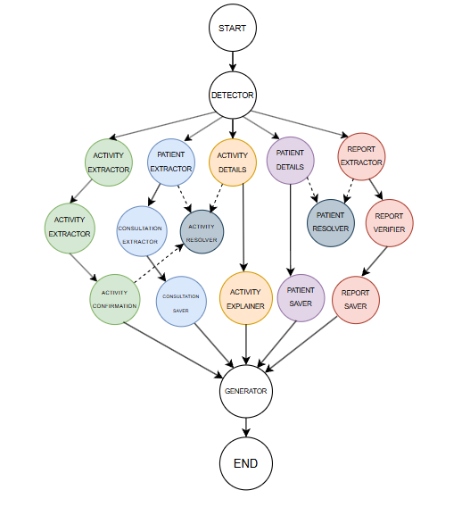

# WardLog — conversational AI for clinical sessions and patient tracking

A side project built around a LangGraph AI pipeline that lets doctors record their work and look up patient information — just by talking or typing.

Instead of filling forms, a doctor describes their shift in plain language and the AI turns it into structured timesheet entries. They can also ask questions about their patients and get answers back from what's been logged.

## Live Demo

**[wardlog.duckdns.org](https://wardlog.duckdns.org)**

> Heads up: the app is hosted on a DuckDNS domain, so the browser may show a "Dangerous" warning. That's a known reputation flag on free dynamic-DNS domains — the site is served over HTTPS (Let's Encrypt) and is safe to click through.

## Screenshots

**Landing / login**

**Log a session by talking or typing — the AI drafts an entry, you approve it before anything's saved**

**When a request is ambiguous, WardLog asks which session you meant**

**Ask about a patient — answers are pulled from what you've logged**

**Reports break down your logged work by activity type and hours**

**Everything lands in a structured timesheet**

## Features

**Logging your work**
- Log sessions by voice or text — describe your shift in plain language, no forms.
- The AI drafts structured entries (type, date, time, duration, location) which you review and approve before anything is saved.
- Nothing is committed without your confirmation — a human-in-the-loop step on every entry.
- When a request is ambiguous, WardLog asks which session you meant instead of guessing.

**Patient tracking**
- Attach patient notes to a session — name, age, diagnosis, prescription.
- Ask about a patient in plain language and get answers pulled from everything you've logged.

**Timesheet & reports**
- All logged sessions roll up into a structured monthly timesheet (calendar view).
- Reports break down your work by activity type and hours, over a range you choose.

## Architecture

WardLog runs as a set of microservices inside a single AWS VPC, split across public, private, and database subnets.

A request comes in through the Internet Gateway to the public EC2, where Apache serves the React frontend and reverse-proxies API calls to the Spring Cloud Gateway. The gateway routes each call to the right service, discovered at runtime through Eureka (the discovery service).

Three services sit in the private subnet: User (auth and accounts), Timesheet (sessions and reports), and the AI service (the LangGraph pipeline that turns speech/text into structured entries). They talk to each other over Kafka, and reach the internet through a NAT gateway.

Data is split by concern: PostgreSQL for user and timesheet data, Neo4j for the patient/session graph the AI queries, and S3 for attachments.

**A note on scope:** this is a side project, so a few things are deliberately consolidated to keep costs down. All the service JARs run on a single private EC2 rather than one box per service, and the User and Timesheet services share a single RDS PostgreSQL instance — separate databases, same instance — instead of one RDS per service. The diagram shows the logical separation; the physical deployment is intentionally leaner.

### The AI pipeline

The AI service is built as a LangGraph graph rather than a single LLM call. A detector node routes each message to the right path — logging an activity, adding patient details, saving a consultation, or answering a report question — and each path runs its own extract → resolve → save steps before a generator node produces the reply.

I used LangGraph here instead of LangChain because a plain LangChain sequence runs one fixed path. With several different intents — activities, patients, reports — the pipeline first has to work out what the user actually means from a free-form message, then branch accordingly. LangGraph's routing makes that branching explicit; a single linear chain couldn't.

## Tech Stack

**Backend** — Java, Spring Boot, Spring Cloud Gateway, Eureka
**AI service** — Python, FastAPI, LangGraph
**AI models (via Groq)** — Llama 3.3 70B (text), Qwen3 (vision), Whisper Large v3 (speech-to-text), Orpheus (text-to-speech)
**Data** — PostgreSQL (RDS), Neo4j, Kafka
**Frontend** — React, Vite, TypeScript
**Infra** — AWS (EC2, VPC, RDS, S3), Apache

## Blog

A deeper technical write-up on how WardLog was built is added to the blog. Make sure to check it out.

**[Read the full write-up →](https://saranbuilds.hashnode.dev/wardlog-doctors-voice-assistant)**

## About this project

I built WardLog during a self-directed break from work, as a way to go deep on a few things I wanted to understand properly — a branching LangGraph AI pipeline, a polyglot microservices setup, and deploying the whole thing to AWS end to end.
